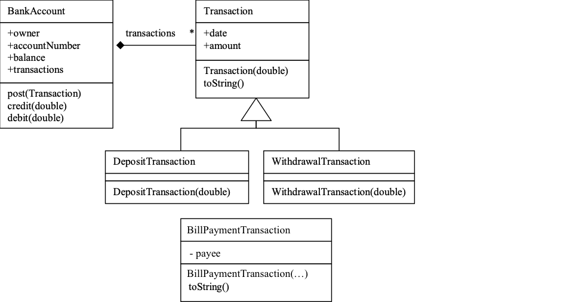
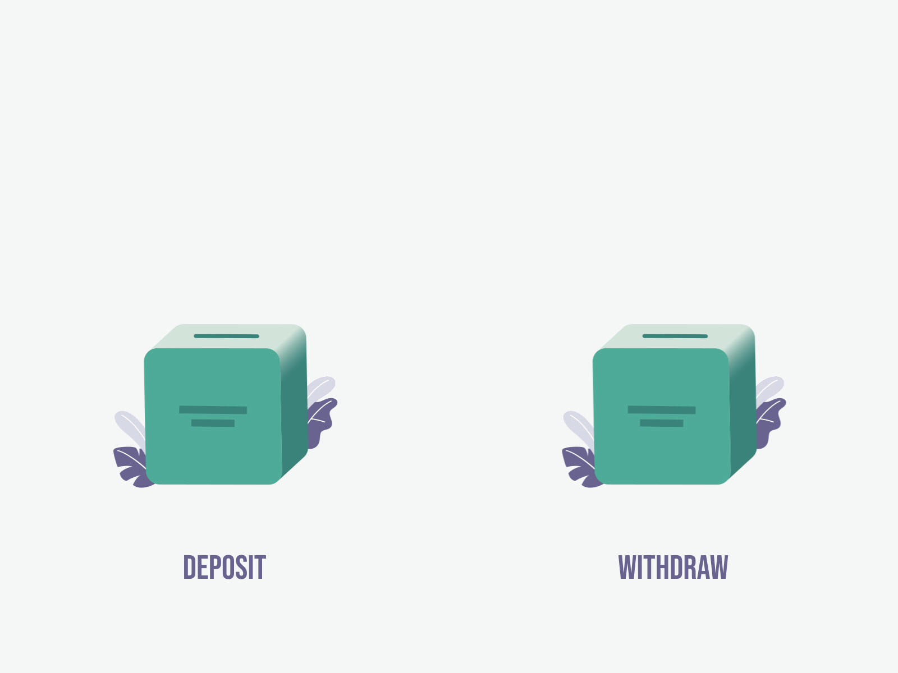

# Simple Banking 

The Bank App is a web application that allows customers to manage their bank accounts. This application allows users to view their accounts, make deposits, withdraw funds and track account activity. Also, users can perform different financial transactions to manage their accounts.

## The main features offered by the project are as follows:

    

- **Account Management**: Users can create new accounts and view their existing accounts.
- **Deposit, Withdrawal and Payment**: Users can deposit money into their accounts and withdraw money from their available balances and payment transactions can be made.
- **Account Activity**: All account transactions (deposits, withdrawals, payments, etc.) can be viewed by users.

## Technologies used in the project

    
    
    
    
    
    
    
    
    
    
    

## How To Run
- Download the project via git:

      git clone https://github.com/Kaganesen/Simple-Banking.git
  
-  To compile and package your project using Gradle, open a terminal in the following directory and copy the following code:

       ./gradlew clean build

- Run the following docker command to create an image:

        docker build -t simple-banking-app .
- To create the jar in the container after creating a Docker image:

        docker run -p 8080:8080 --name simple-banking simple-banking-app
  
- Paste this line into your browser to check that the project is working:

        http://localhost:8080/swagger-ui/index.html#/
   

### BONUS Task 1: Find a better implementation alternative
The bank account post method must do something special for each Transaction type. e.g. post(DepositTransaction) and post(WithdrawalTransaction. This solution will work but creating families of overloaded methods is discouraged as it causes problems with maintenance. Consider, if we added more Transaction subclasses we would need to keep changing the BankAccount class, overloading even more post methods. It is considered bad form in OO  to write case statements based on the type of objects. It also has the same maintenance problems as the first solution. Adding more Transaction subclasses would require changes. Find a solution to delegate the operation using polymorphism so that the Bank account is never changed by introducing new transaction types. At a öinimum you shoudl make the provided uni test to run:

## Task 2:  Provide a REST API using Spring Rest Controllers and TEST
Provide a REST API to the banking system as follows. The following code demonstrates how BankAccounts might be used.  Use services and repositories to persist your model above into a Database using JPA.  Please provide tests (MOCK or othrewise) for your code:

To deposit money into an account, one would use:

    curl --location --request POST 'http://localhost:8080/account/v1/credit/669-7788' \
    --header 'Content-Type: application/json' \
    --header 'Accept: application/json' \
    --data-raw '    {
            "amount": 1000.0
        }'

    response would be (200):
    {
        "status": "OK",
        "approvalCode": "67f1aada-637d-4469-a650-3fb6352527ba"
    }

To withdraw money:

    curl --location --request POST 'http://localhost:8080/account/v1/debit/669-7788' \
    --header 'Content-Type: application/json' \
    --header 'Accept: application/json' \
    --data-raw '    {
            "amount": 50.0
        }'

    response would be (200):
    {
        "status": "OK",
        "approvalCode": "a66cce54-335b-4e46-9b49-05017c4b38dd"
    }

To get the current account data, one would use:

    curl --location --request GET 'http://localhost:8080/account/v1/669-7788'

    response would be:

    {
        "accountNumber": "669-7788",
        "owner": "Kerem Karaca",
        "balance": 950.0,
        "createDate": "2020-03-26T06:15:50.550+0000",
        "transactions": [
            {
                "date": "2020-03-26T06:16:03.563+0000",
                "amount": 1000.0,
                "type": "DepositTransaction",
                "approvalCode": "67f1aada-637d-4469-a650-3fb6352527ba"
            },
            {
                "date": "2020-03-26T06:16:35.047+0000",
                "amount": 50.0,
                "type": "WithdrawalTransaction",
                "approvalCode": "a66cce54-335b-4e46-9b49-05017c4b38dd"
            }
        ]
    }

## Reference Documentation
For further reference, please consider the following sections:

* [Official Gradle documentation](https://docs.gradle.org)
* [Spring Boot Gradle Plugin Reference Guide](https://docs.spring.io/spring-boot/docs/2.2.5.RELEASE/gradle-plugin/reference/html/)
* [Spring Boot DevTools](https://docs.spring.io/spring-boot/docs/2.2.5.RELEASE/reference/htmlsingle/#using-boot-devtools)

### Guides
The following guides illustrate how to use some features concretely:

* [Building REST services with Spring](https://spring.io/guides/tutorials/bookmarks/)

### Additional Links
These additional references should also help you:
* [Gradle Build Scans – insights for your project's build](https://scans.gradle.com#gradle)

